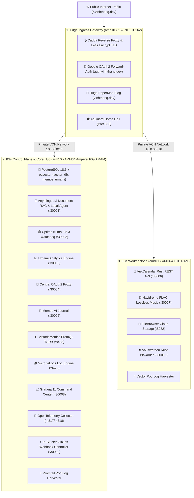
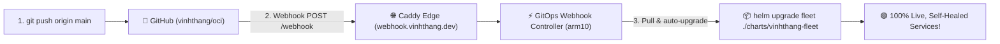

# 🌟 Vinh Thang Cloud & AI Fleet (`vinhthang.dev`)

[](https://k3s.io)
[](https://helm.sh)
[](https://www.oracle.com/cloud/free/)
[](https://www.postgresql.org)
[](https://victoriametrics.com)
[](https://victoriametrics.com/products/victorialogs/)
[](https://grafana.com)
[](https://github.com/vinhthang/oci)

Automated, production-grade Infrastructure as Code (IaC), **Master Helm Chart (`charts/vinhthang-fleet`)**, **Kubernetes K3s cluster manifests**, **GitOps Webhook automation**, and **full 360-degree observability suite** running on Oracle Cloud Infrastructure (OCI) under [**`vinhthang.dev`**](https://vinhthang.dev).

---

## 🏛️ Fleet Architecture Topology



---

## 🌐 Master Production Services Directory

| Service | Official HTTPS URL | Access Control | Tech Stack & Persistence | Host Node |
| :--- | :--- | :--- | :--- | :--- |
| **📈 Grafana UI** | 👉 [**`grafana.vinhthang.dev`**](https://grafana.vinhthang.dev) | 🔒 Google SSO Auto-Login | Grafana 11 / Multi-Engine Dashboards | `arm10` |
| **🟢 Uptime Kuma v2.5.3** | 👉 [**`status.vinhthang.dev`**](https://status.vinhthang.dev) | 🔒 Google SSO Auto-Login | Node.js / SQLite (WAL) / 9 Monitors | `arm10` |
| **📈 Umami Analytics** | 👉 [**`analytics.vinhthang.dev`**](https://analytics.vinhthang.dev) | 🔒 Google SSO / Cookieless | Next.js / PostgreSQL 18 Relational | `arm10` |
| **🤖 AnythingLLM AI** | 👉 [**`ai.vinhthang.dev`**](https://ai.vinhthang.dev) | 🔒 Google SSO Protected | Node.js / PostgreSQL 18 `pgvector` | `arm10` |
| **📝 Memos AI Journal** | 👉 [**`memos.vinhthang.dev`**](https://memos.vinhthang.dev) | PostgreSQL 18 Persistence | Go / PostgreSQL 18 Relational | `arm10` |
| **🔒 Vaultwarden** | 👉 [**`vault.vinhthang.dev`**](https://vault.vinhthang.dev) | 🔐 Zero-Knowledge Client Auth | **Pure Rust / SQLite WAL (<30 MB RAM)** | `amd11` |
| **📁 FileBrowser Storage** | 👉 [**`files.vinhthang.dev`**](https://files.vinhthang.dev) | 🔒 Google SSO Protected | Go / Local Host Disk Storage | `amd11` |
| **🎵 Navidrome Lossless** | 👉 [**`music.vinhthang.dev`**](https://music.vinhthang.dev) | Subsonic API / Local Auth | Go / 45 GB FLAC Audio Library | `amd11` |
| **📝 Hugo Tech Blog** | 👉 [**`vinhthang.dev`**](https://vinhthang.dev) | Public Edge Static CDN | Go Hugo / PaperMod Theme / Minified | `amd10` |
| **🔌 VietCalendar API** | 👉 [**`api.vinhthang.dev`**](https://api.vinhthang.dev) | Public Stateless API | **Pure Rust / In-Memory Registers / Zero DB** | `amd11` |
| **🛡️ AdGuard Home** | 👉 [**`adguard.vinhthang.dev`**](https://adguard.vinhthang.dev) | Admin Basic Auth | Go / Private DNS-over-TLS (Port 853) | `amd10` |
| **🔄 GitOps Webhook** | 👉 [**`webhook.vinhthang.dev`**](https://webhook.vinhthang.dev) | Automated Webhook Ingress | Alpine Linux / Helm 3 / Auto-Deployer | `arm10` |
| **📊 VictoriaMetrics** | `http://victoriametrics:8428` | Internal K8s Service | PromQL TSDB (< 35 MB RAM / 30d Retention) | `arm10` |
| **🪵 VictoriaLogs** | `http://victorialogs:9428` | Internal K8s Service | LogsQL Log Engine (< 40 MB RAM / 15x Compression) | `arm10` |
| **🔭 OpenTelemetry Collector**| `otel-collector:4317` / `:4318` | Internal K8s Service | OTel Contrib APM Tracing & Metrics | `arm10` |

---

## 📦 Master Helm Chart (`charts/vinhthang-fleet`)

The entire microservice fleet is bundled into a single declarative Master Helm Chart:

```bash
# 1-Command Complete Fleet Upgrade & Sync
helm upgrade --install fleet ./charts/vinhthang-fleet --kube-context oci-k3s
```

All microservice configurations, memory requests/limits, image tags, and NodePorts are centrally managed in [`charts/vinhthang-fleet/values.yaml`](charts/vinhthang-fleet/values.yaml).

---

## 🔄 Automated GitOps Workflow

This repository runs on **Zero-Touch GitOps**:



Whenever commits are pushed to `main`:
1. GitHub triggers the webhook at `https://webhook.vinhthang.dev/webhook`.
2. The in-cluster **GitOps Webhook Controller** pulls the new commit.
3. Automatically executes `helm upgrade --install fleet /repo/charts/vinhthang-fleet`.
4. Kubernetes rolls out updates seamlessly with zero downtime!

---

## 🛡️ Reliability & Security Highlights

* **🩺 Self-Healing Kubernetes Probes**: Every deployment is equipped with `livenessProbe` and `readinessProbe` to automatically detect hung processes and restart containers instantly.
* **🔒 Central Google Single Sign-On**: Unified OAuth2 Gateway (`auth.vinhthang.dev`) with Caddy `forward_auth` protecting Grafana, Uptime Kuma, AnythingLLM, FileBrowser, and Umami.
* **🛡️ Hardened Edge Security Headers**: Strict `X-Content-Type-Options: nosniff`, `X-Frame-Options: SAMEORIGIN`, and `Referrer-Policy: strict-origin-when-cross-origin` enforced across all subdomains.
* **🐘 High-Performance Vector Database**: PostgreSQL 18.6 with `pgvector 0.8.6` providing persistent document vector embeddings for local AI agents.

---

## 📁 Repository Directory

```text
├── charts/
│   └── vinhthang-fleet/     # 📦 Production Master Helm Chart
│       ├── Chart.yaml       # Helm metadata & version definitions
│       ├── values.yaml      # Centralized fleet configuration & limits
│       └── templates/       # Kubernetes manifest templates (15 services)
├── k8s/                     # Raw Declarative Kubernetes manifests & Grafana dashboards
├── blog/                    # Hugo static tech blog Markdown content & posts
├── scripts/
│   └── gitops-sync.sh       # Local GitOps sync & Hugo rebuild helper script
├── .github/
│   └── workflows/
│       └── deploy.yaml      # GitHub Actions CI/CD Helm linting & validation workflow
├── provider.tf              # OCI Terraform provider configuration
├── compute.tf               # Terraform VM compute instances & Reserved Static IPs
├── network.tf               # Terraform VCN, Subnets, Internet Gateways & Security Lists
├── variables.tf             # Terraform input parameters
├── outputs.tf               # Terraform outputs (IPs, SSH commands, endpoints)
└── docs/
    └── oci-cli-guide.md     # Complete OCI CLI commands reference guide
```

---

## 🚀 Quickstart & Terraform Provisioning

### 1. Configure Variables
```bash
cp terraform.tfvars.example terraform.tfvars
```
Edit `terraform.tfvars` with your Tenancy OCID and SSH Public Key (`cat ~/.ssh/id_ed25519.pub`).

### 2. Plan & Apply Infrastructure
```bash
terraform init
terraform plan
terraform apply
```

---

## 📄 License
Open source under the [MIT License](LICENSE). Maintained by [Thang Hoang](https://vinhthang.dev).
