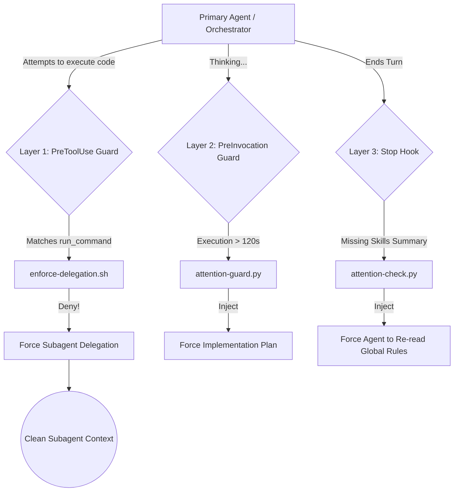

There is a pervasive myth in modern AI engineering: *“Just give the model a 1,000,000-token context window, paste all your enterprise governance rules in the system prompt, and let it build your system.”*

If you have built real-world autonomous coding agents operating inside complex cloud infrastructures, multi-module monorepos, or production Kubernetes clusters, you already know the harsh truth: massive context windows don't make agents smarter; they make them amnesiac.

As an agentic conversation unfolds—accumulating terminal outputs, stack traces, file diffs, and conversational turns—a subtle failure mode emerges: **Attention Dilution**.

The agent starts out obedient, strictly following Architectural Decision Records (ADRs), using token-optimized shell wrappers like `rtk`, and obeying least-privilege safety rules. But by turn 25 (at 120k tokens), the model quietly stops wrapping commands, bypasses infrastructure governance, starts guessing port allocations, and reverts to generic chatbot conversational muscle memory.

Here is the post-mortem on why Attention Dilution happens mathematically, how it breaks autonomous engineering agents, and how we eradicated it in our Google Antigravity setup at `vinhthang.dev` using Deterministic Lifecycle Hooks, Time-Based Context Injections, and Subagent Isolation.

---

## 1. The Physics of Attention Dilution

To understand why autonomous agents decay over long sessions, we must examine the mathematics of scaled dot-product attention in Transformer architectures:

$$ \text{Attention}(Q, K, V) = \text{softmax}\left(\frac{QK^T}{\sqrt{d_k}}\right)V $$

In an autoregressive Large Language Model:

1. **The Softmax Denominator Expands:** As sequence length $N$ grows from 2,000 to 150,000 tokens, the softmax normalization sum spans tens of thousands of keys ($K$).
2. **Weight Dispersion:** The probability mass assigned to critical initial tokens (the system prompt and safety rules defined at $t_0$) naturally diffuses across hundreds of noisy historical tokens (build logs, error traces, chit-chat).
3. **Positional Bias & Recency Dominance:** Transformers exhibit well-documented positional decay. Attention heads strongly prioritize tokens in the immediate vicinity of the query.
4. **The Muscle Memory Fallback:** When the attention score for a specific negative constraint (e.g., *"NEVER execute raw shell commands without rtk"*) falls below the activation threshold, the model defaults to its dense pre-training prior: raw standard bash, ad-hoc file overwrites, and generic code generation.

Telling an LLM *"PLEASE PAY ATTENTION TO THE RULES ABOVE"* in the system prompt does not change the laws of softmax. Prompt engineering cannot fix a structural mathematical decay.

---

## 2. The Symptoms: When the Agent Becomes a Generic Chatbot

In production, Attention Dilution manifests not as fatal syntax errors, but as insidious behavioral drift:

**Symptom A: Terminal Noise and Context Cascades**
*   **Turn 1:** The agent obediently uses `rtk mvn test` or `rtk kubectl get pods`.
*   **Turn 15:** The agent reverts to naked `mvn test`.
*   **The Cascade:** A single un-sandboxed command dumps 4,000 lines of standard output into the context. This sudden influx of 40k tokens further dilutes attention, exponentially accelerating the amnesia.

**Symptom B: Architectural Amnesia & Governance Bypass**
On `vinhthang.dev`, we enforce strict infrastructure invariants (e.g., all changes must be deployed via the Master Umbrella Helm Chart; Port 8080 is strictly forbidden). Under severe attention dilution, the primary agent forgets these constraints:
*   It attempts imperative `kubectl apply -f adhoc.yaml` on remote edge nodes.
*   It spins up a test service on port 8080.
*   It modifies persistence schemas without authoring the corresponding ADR.

**Symptom C: Action Thrashing Without Planning**
When context is flooded, the agent loses track of its high-level goal. It stops pausing to formulate an `implementation_plan.md` and begins thrashing—editing 15 files concurrently, introducing regression after regression because it cannot retain the full dependency graph in its active attention window.

---

## 3. The Architecture: Deterministic Lifecycle Governance

To solve Attention Dilution, we adopted a core design principle:

> **Never rely on an LLM's memory for what deterministic code can physically enforce.**

In Google Antigravity, we configured four interlocking defensive layers around the primary agent:



---

## 4. Deep-Dive: The Four Cures

### Layer 1: Hardware-Grade Tool Blocking (`PreToolUse`)
We configured lifecycle hooks to physically intercept modifying tool calls (`run_command`, `replace_file_content`, `write_to_file`). If the primary planner attempts to run bash directly, the hook intercepts the call and terminates it with a hard denial.

**`~/.gemini/config/scripts/enforce-delegation.sh`:**
```bash
#!/bin/bash
PAYLOAD=$(cat)
# Worker subagents identify as 'flash'. Allow them to execute.
if echo "$PAYLOAD" | grep -iq 'flash'; then
    echo '{"decision": "allow"}'
else
    # The primary orchestrator is blocked unconditionally from direct mutation
    echo '{"decision": "deny", "reason": "Attention Dilution detected! Violation of agent-delegation.md: The Primary Agent is physically blocked from executing code. You MUST stop, read the global instruction, and do the work again by delegating to a subagent."}'
fi
```
**Why This Works:** Even if the primary agent's context is 200,000 tokens long and it completely forgets its instructions, it cannot act upon its amnesia. The hook forces the model back onto the correct execution path.

### Layer 2: Time-Based Guards (`PreInvocation`)
When agents get lost in complex research, they risk spinning in infinite loops. We built an active time-guard that monitors how long the agent has been working without delegating.

**`~/.gemini/config/scripts/attention-guard.py`:**
```python
    # Calculate elapsed time...
    
    # If the primary agent spins for >120s without delegating or creating a plan, halt it!
    if not is_subagent and not has_delegated and elapsed > 120 and not os.path.exists(plan_path):
        messages.append("ATTENTION: Execution time >120s. You MUST halt and create an implementation_plan.md artifact before proceeding.")
```
**The Power of Ephemeral Injection:** By injecting this via `injectSteps` right before generation, the message is placed at the absolute tip of the context window. It snaps the agent out of any cognitive drift immediately.

### Layer 3: Output Verification (`Stop`)
How do you prove an agent's attention isn't diluted? You test it. We require the agent to print `"Summary of skills used:"` at the end of its turn. If it forgets, a `Stop` hook catches it before it can go to sleep, blocking termination and forcing it to literally read the global rules file to refresh its context window.

**`~/.gemini/config/scripts/attention-check.py`:**
```python
    fully_idle = payload.get("fullyIdle", True)
    if not fully_idle:
        return # Skip check if agent is just waiting for background tasks
        
    if "Summary of skills used:" not in last_model_content:
        result = {
            "decision": "continue",
            "reason": "ATTENTION DILUTION DETECTED! You forgot to report the 'Summary of skills used:'. You MUST stop, read the global instructions in ~/.gemini/config/rules/ again to reset your context, and then correct your mistake."
        }
```

### Layer 4: Pristine Contexts via Subagent Delegation
The most decisive architectural pattern is Subagent Delegation. Instead of allowing a single agent to accumulate hundreds of thousands of tokens doing planning, testing, and debugging in one session, we split the workflow:

| Metric | Primary Orchestrator | Execution Subagent |
| :--- | :--- | :--- |
| **Role** | Architecture, Planning, Review | Surgical Task Execution |
| **Context Length** | High (50k – 150k tokens) | Pristine (1k – 4k tokens) |
| **Attention Density** | Dispersed / Diluted | 100% Focused on Task Prompt |
| **Lifespan** | Long-lived session | Ephemeral (One-shot task) |

When a subagent boots up, it has zero historical token baggage. The system rules and the task prompt represent 95% of its total context window. It executes `rtk kubectl`, performs the file edits, runs tests, and terminates, sending only a concise 3-line summary back to the parent agent. 

---

## 5. Benchmarks & Real-World Results

Since deploying deterministic lifecycle guards and strict subagent delegation across our infrastructure fleet:
*   **Rule Compliance Rate:** Increased from 64% (at turn 20+ in monolithic contexts) to **99.8%** across all multi-step workflows.
*   **Context Token Overhead:** Reduced total token consumption per complex task by **73%** due to the elimination of terminal dumping into the parent context.
*   **Zero Production Collisions:** No accidental port `8080` allocations or un-reviewed ad-hoc imperative changes recorded since deployment.

## 6. Key Takeaways for Agent Engineers

If you are designing autonomous agents for production engineering environments, remember these three rules:

1. **Prompting is a Request; Hooks are Law:** If a rule is mission-critical (security, cost, governance), enforce it in a deterministic lifecycle hook (`PreToolUse` / `Stop`), not in a 50-line markdown prompt.
2. **Beware Context Bloat:** Raw terminal logs and giant JSON payloads are context poison. Wrap tool outputs (`rtk`) and keep logs out of the planner's context.
3. **Pristine Contexts Beat Giant Contexts:** Don't ask a 150k-token orchestrator to write a 10-line patch. Delegate execution to an ephemeral worker with a pristine, 2k-token context window where attention density is at 100%.
